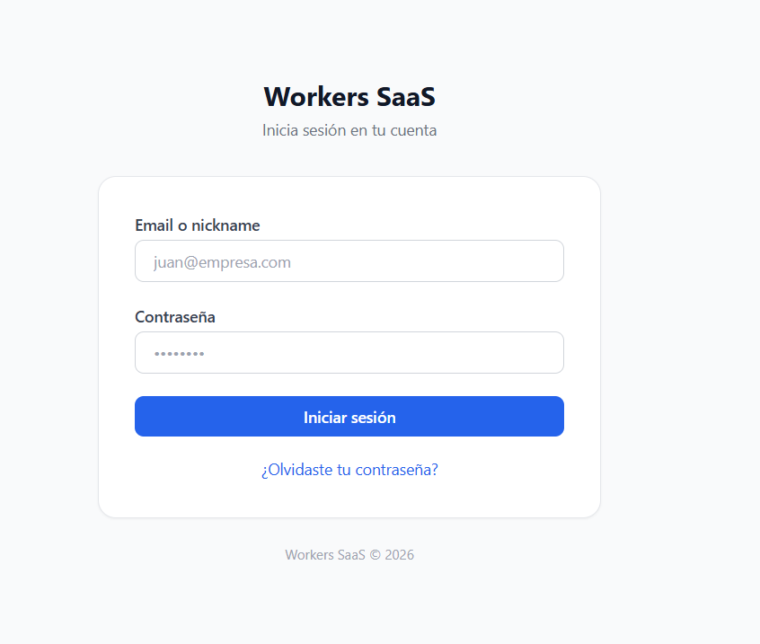
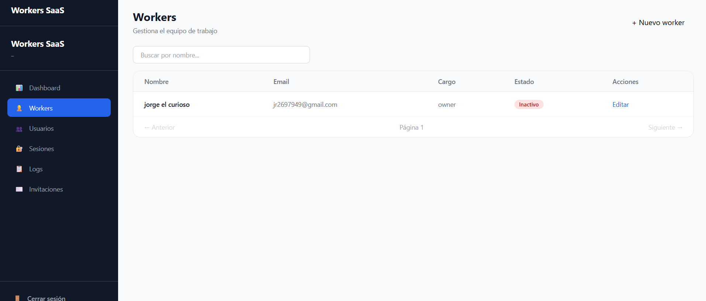

# Workers SaaS

Sistema SaaS para la gestión de trabajadores, usuarios y accesos dentro de una organización.

Workers SaaS permite administrar trabajadores, controlar permisos mediante roles y niveles jerárquicos, gestionar sesiones activas, registrar eventos de auditoría, enviar invitaciones por correo electrónico y exportar información de manera segura.

## Demo

Aplicación desplegada:

https://workers-saas.vercel.app/

---

## Características principales

### Autenticación y seguridad

* Inicio de sesión mediante email o nickname.
* Contraseñas cifradas con bcrypt.
* Tokens JWT para autenticación.
* Verificación de permisos basada en roles y niveles.
* Protección de rutas privadas.
* Validación de datos mediante Zod.

### Gestión de trabajadores

* Registro de trabajadores.
* Edición de información.
* Control de estado activo/inactivo.
* Búsqueda y filtrado.

### Gestión de usuarios

* Administración de usuarios del sistema.
* Asociación entre usuarios y trabajadores.
* Control de acceso por nivel jerárquico.

### Sistema de roles

Roles disponibles:

| Rol         | Nivel |
| ----------- | ----: |
| Super Admin |   100 |
| Owner       |    90 |
| HR          |    70 |
| Security    |    60 |
| Manager     |    50 |
| Worker      |    10 |

Los permisos se validan utilizando niveles jerárquicos para garantizar que cada usuario solo pueda acceder a los recursos permitidos.

### Logs de actividad

Registro de acciones relevantes del sistema:

* Inicio de sesión.
* Cierre de sesión.
* Creación de usuarios.
* Actualización de registros.
* Operaciones administrativas.

### Sesiones activas

* Visualización de sesiones abiertas.
* Control de accesos.
* Monitoreo de actividad.

### Invitaciones por correo

* Generación de invitaciones.
* Envío automático mediante correo electrónico.
* Registro de estado de invitaciones.

### Exportación de datos

* Exportación de información.
* Generación de reportes para administración.

### Caché con Redis

* Caché de consultas frecuentes.
* Reducción de carga sobre la base de datos.
* Estrategias de invalidación para mantener consistencia.

---

## Arquitectura

El proyecto sigue una arquitectura basada en capas:

Frontend (React)
↓
API REST (Express)
↓
Service Layer
↓
Repository Layer
↓
Prisma ORM
↓
PostgreSQL

La separación de responsabilidades permite mantener el código escalable, mantenible y fácil de extender.

---

## Tecnologías utilizadas

### Backend

* Node.js
* Express
* Prisma ORM
* PostgreSQL
* Redis (Upstash)
* JWT
* bcrypt
* Zod
* dotenv
* ExcelJS
* Jest

### Frontend

* React 18
* Vite
* Tailwind CSS
* React Router DOM
* Axios
* Recharts
* Context API

### Infraestructura

* Docker
* Docker Compose
* GitHub Actions
* Vercel
* Render
* Supabase
* Upstash Redis
* Resend

---

## Estructura del proyecto

```text
workers-saas/
│
├── backend/
│   ├── src/
│   ├── prisma/
│   ├── tests/
│   └── ...
│
├── frontend/
│   ├── src/
│   ├── components/
│   ├── pages/
│   └── ...
│
└── README.md
```

## CI/CD

El proyecto incluye integración continua mediante GitHub Actions.

Procesos automatizados:

* Instalación de dependencias.
* Ejecución de pruebas.
* Verificación de calidad.
* Despliegue automático.

---

## Capturas

### Inicio de sesión



### Gestión de trabajadores



---

## Instalación local

### 1. Clonar repositorio

```bash
git clone https://github.com/jota-25/Workers-SaaS---Workforce-Management-Platform.git

cd workers-saas
```

---

## Ejecutar con Docker (Recomendado)

### Configurar variables de entorno

Crear los archivos:

```txt
backend/.env
frontend/.env
```

### Levantar servicios

```bash
docker compose up --build
```

### Ejecutar en segundo plano

```bash
docker compose up -d
```

La aplicación quedará disponible en:

```txt
Frontend: http://localhost:5173
Backend:  http://localhost:3000
```
El proyecto incluye un entorno de desarrollo basado en Docker Compose.

Servicios incluidos:

| Servicio | Descripción |
|-----------|-------------|
| PostgreSQL | Base de datos principal |
| Backend | API REST construida con Express |
| Frontend | Aplicación React + Vite |

Servicios externos:

| Servicio | Descripción |
|-----------|-------------|
| Upstash Redis | Caché distribuida |
| Resend | Envío de correos |
---

## Instalación manual

### Backend

```bash
cd backend

npm install

npm run dev
```

### Frontend

```bash
cd frontend

npm install

npm run dev
```

## Docker Compose


## Variables de entorno

Backend:

```env
DATABASE_URL=
JWT_SECRET=
REDIS_URL=
REDIS_TOKEN=
RESEND_API_KEY=
```

Frontend:

```env
VITE_API_URL=
```

---

## Roadmap

* [x] Gestión de trabajadores
* [x] Gestión de usuarios
* [x] Roles y permisos
* [x] JWT Authentication
* [x] Logs de actividad
* [x] Sesiones activas
* [x] Sistema de invitaciones
* [x] Exportación de datos
* [x] Redis Cache
* [x] Docker
* [x] CI/CD
* [ ] Dashboard avanzado
* [ ] Notificaciones en tiempo real
* [ ] Métricas y analítica

---

## Autor

Desarrollado por Jose Carlos.

Proyecto construido con enfoque en Backend Development, Arquitectura de Software, Seguridad y Escalabilidad.
